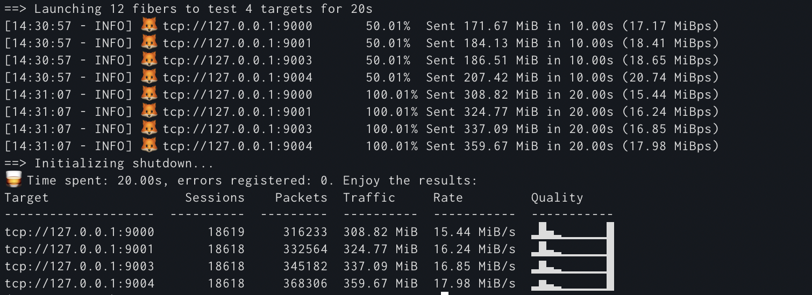

# FiberFox 🦊  

High-performance (D)DoS vulnerability testing toolkit. Implements various L4/7 attack vectors. Async approach to networking helps to lower CPU/RAM requirements while performing even those attacks that are known to be problematic from implmenetation perspective.

NOTE: The toolkit doesn't have capabilities needed for proper performance testing of the target servers or networks. The goal is to understand level of protection, by performing attacks specially designed to abuse common pitfalls and to bypass common protection measures.

WARNING: Do not test infrastructure (servers, websites, network devices, etc) without owner's consent. Package default settings are tuned to avoid large impact when running tests.

Inspired by [MHDDoS](https://github.com/MHProDev/MHDDoS) project.



## Install

From PyPI:

```shell
$ pip install fiberfox
```

From sources:

```shell
$ git clone https://github.com/kachayev/fiberfox.git
$ cd fiberfox
$ python setup.py install
```

Build Docker image:

```shell
$ git clone https://github.com/kachayev/fiberfox.git
$ cd fiberfox
$ docker build -t fiberfox .
```

## Usage

Example:

```shell
$ fiberfox \
    --targets tcp://127.0.0.1:8080 http://127.0.0.1:8081 \
    --concurrency 512 \
    --rpc 1024 \
    --strategy STRESS \
    --duration-seconds 3600 \
    --proxies-list ./proxies.txt
```

Features:
* `--concurrency` (or `-c`) defines number of async coroutines to run. Fiber doesn't create a new OS thread so you can run a lot of them with small overhead. For TCP attack vectors, number of fibers rougly corresponds to the max number of open TCP connections. For UDP attacks, running too many fibers typically makes performance worse.
* Muliple targets are supported. Each fiber picks up target by cycling over the list of them. If fiber session is too long (e.g. when using attack vectors like `SLOW` or `CONNECTIONS`, make sure to setup more fibers than you have targets).
* Connections could be established using HTTP/SOCK4/SOCK5 proxies. Available proxies could be setup from the static configuration file or dynamically resolved from proxy providers. The tool automatically detects "dead" proxies and removes them from the pool.

More documentation about flags:

```
$ python fiberfox --help
usage: fiberfox [-h] [--targets [TARGETS ...]] [-c CONCURRENCY] [-s {UDP,TCP,STRESS,BYPASS,CONNECTION,SLOW,CFBUAM,AVB}] [--rpc RPC] [--packet-size PACKET_SIZE] [-d DURATION_SECONDS]
               [--providers-config PROVIDERS_CONFIG] [--proxies-list PROXIES_LIST] [--proxies [PROXIES ...]]

options:
  -h, --help            show this help message and exit
  --targets [TARGETS ...]
                        List of targets, separated by spaces (if many)
  -c CONCURRENCY, --concurrency CONCURRENCY
                        Number of fibers per target (for TCP means max number of open connections)
  -s {UDP,TCP,STRESS,BYPASS,CONNECTION,SLOW,CFBUAM,AVB}, --strategy {UDP,TCP,STRESS,BYPASS,CONNECTION,SLOW,CFBUAM,AVB}
                        Flood strategy to utilize
  --rpc RPC             Number of requests to be sent to each connection
  --packet-size PACKET_SIZE
                        Packet size (in bytes)
  -d DURATION_SECONDS, --duration-seconds DURATION_SECONDS
                        How long to keep sending packets, in seconds
  --providers-config PROVIDERS_CONFIG
                        Configuration file with proxy providers
  --proxies-list PROXIES_LIST
                        List proxies
  --proxies [PROXIES ...]
                        List of proxy servers, separated by spaces (if many)
```

## Attack Vectors

Attack vector is defined by `--strategy` option when execution the script.

Note: the package is under active development, more methods will be added soon.

### L4

* `UDP`
* `TCP`
* `CONNECTION`

### L7

* `GET`
* `STRESS`
* `BYPASS`
* `CFBUAM`
* `SLOW`
* `AVB`

## Analysis

The tool reports number of statistics per each target: number of packets, traffic, rate. For TCP-based attacks (both L4 and L7), it also reports histogram of packets sent within a single session (session here means traffic sent within a single open connection). Ideally, the histogram should be skewed towards left side. It means the peer closes connection earlier than "requests per connection" packets were sent. If it's mainly on the right, the target accepts what should be considered "garbage traffic".

Be careful with analysis. Low network rate, high frequency of connection attempts, high error rate, and more. All of those signals might indicate both the fact that the target stays storng facing the attack and that it's already dead. To get full understanding of the level of protection, you should use monitoring information on the target side (e.g. capability to work correctly when being challenged).

## Contribute

* Check for open issues or open a fresh issue to start a discussion around a feature idea or a bug.
* Fork the repository on Github & fork master to `feature-*` branch to start making your changes.

## License

Release under the MIT license. See LICENSE for the full license.

```

                                        ████                                
                                    ████▒▒██                                
                                  ████  ▒▒██                                
                                ██▒▒  ▒▒▒▒▒▒██                              
                              ██▒▒██        ██                              
  ████                      ██▒▒██          ██                              
██▒▒▒▒██████                ██▒▒██      ▒▒  ████                            
██▒▒▒▒██    ████      ██████▒▒▒▒▒▒██    ▒▒▒▒██████████████                  
██▒▒    ████▒▒▒▒██████▒▒▒▒▒▒▒▒▒▒▒▒▒▒██▒▒▒▒▒▒██▒▒▒▒▒▒▒▒▒▒▒▒████              
██▒▒▒▒      ██▒▒▒▒▒▒▒▒▒▒▒▒▒▒▒▒▒▒▒▒▒▒▒▒▒▒▒▒██▒▒██▒▒▒▒▒▒▒▒▒▒▒▒▒▒██            
  ██▒▒      ██▒▒▒▒▒▒▒▒▒▒▒▒▒▒▒▒▒▒▒▒▒▒▒▒▒▒▒▒██▒▒██▒▒▒▒▒▒▒▒▒▒▒▒▒▒▒▒████        
  ██        ██▒▒▒▒▒▒▒▒▒▒▒▒▒▒▒▒▒▒▒▒▒▒▒▒▒▒▒▒▒▒██▒▒▒▒▒▒▒▒▒▒▒▒▒▒▒▒▒▒▒▒▒▒██      
  ██▒▒    ██▒▒▒▒▒▒▒▒▒▒▒▒▒▒▒▒▒▒▒▒▒▒▒▒▒▒▒▒▒▒▒▒████▒▒▒▒▒▒▒▒▒▒▒▒▒▒▒▒▒▒▒▒▒▒██    
  ██▒▒▒▒  ▒▒▒▒▒▒▒▒▒▒▒▒▒▒▒▒▒▒▒▒▒▒▒▒▒▒▒▒▒▒▒▒▒▒▒▒  ██▒▒▒▒▒▒▒▒▒▒▒▒▒▒▒▒▒▒▒▒██    
    ██▒▒▒▒▒▒▒▒▒▒▒▒▒▒▒▒▒▒▒▒▒▒▒▒▒▒▒▒▒▒▒▒▒▒▒▒▒▒    ██▒▒▒▒▒▒▒▒▒▒████▒▒▒▒▒▒▒▒██  
    ████▒▒▒▒▒▒▒▒▒▒▒▒▒▒▒▒▒▒▒▒▒▒▒▒▒▒▒▒▒▒▒▒██      ██▒▒▒▒▒▒████▒▒▒▒▒▒▒▒▒▒▒▒██  
    ██▒▒██▒▒▒▒▒▒▒▒▒▒▒▒▒▒▒▒▒▒▒▒▒▒▒▒▒▒▒▒██        ██▒▒▒▒██▒▒▒▒▒▒▒▒▒▒▒▒▒▒▒▒██  
      ██▒▒██▒▒▒▒▒▒▒▒▒▒▒▒▒▒▒▒▒▒▒▒▒▒▒▒▒▒██        ██████▒▒▒▒▒▒▒▒▒▒▒▒▒▒▒▒▒▒██  
      ██▒▒██▒▒▒▒▒▒▒▒▒▒▒▒▒▒▒▒▒▒▒▒▒▒▒▒▒▒██      ██▒▒▒▒▒▒▒▒▒▒▒▒▒▒▒▒▒▒▒▒▒▒▒▒▒▒██
        ████  ▒▒▒▒▒▒▒▒▒▒▒▒▒▒▒▒▒▒▒▒▒▒▒▒▒▒    ██▒▒▒▒▒▒▒▒▒▒▒▒▒▒▒▒▒▒▒▒▒▒▒▒▒▒▒▒██
          ██    ▒▒██████▒▒▒▒▒▒▒▒▒▒▒▒▒▒    ██▒▒  ▒▒▒▒▒▒▒▒▒▒▒▒▒▒▒▒▒▒▒▒▒▒▒▒▒▒██
          ██            ████▒▒▒▒▒▒▒▒▒▒    ██  ▒▒  ▒▒        ▒▒▒▒▒▒▒▒▒▒▒▒██  
            ██                      ██  ████  ▒▒          ▒▒▒▒▒▒▒▒▒▒▒▒▒▒██  
              ██                      ██▒▒██              ▒▒  ▒▒▒▒▒▒▒▒▒▒██  
                ██████████████████████▒▒▒▒██                    ▒▒▒▒▒▒██    
                      ██▒▒      ██▒▒▒▒▒▒▒▒██                    ▒▒▒▒██      
                      ██▒▒▒▒  ██▒▒▒▒▒▒▒▒████                  ▒▒▒▒██        
                      ██▒▒▒▒▒▒██▒▒▒▒▒▒██  ██                    ██          
                        ██████▒▒▒▒▒▒██    ██                ████            
                              ██████      ██          ██████                
                                            ██    ████                      
                                            ██████                          
```
